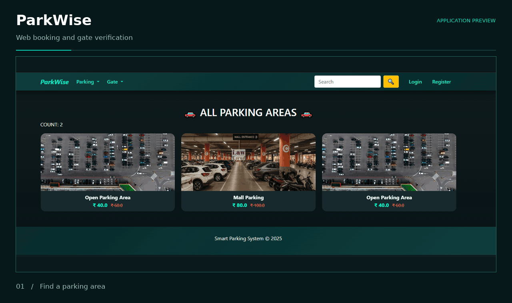
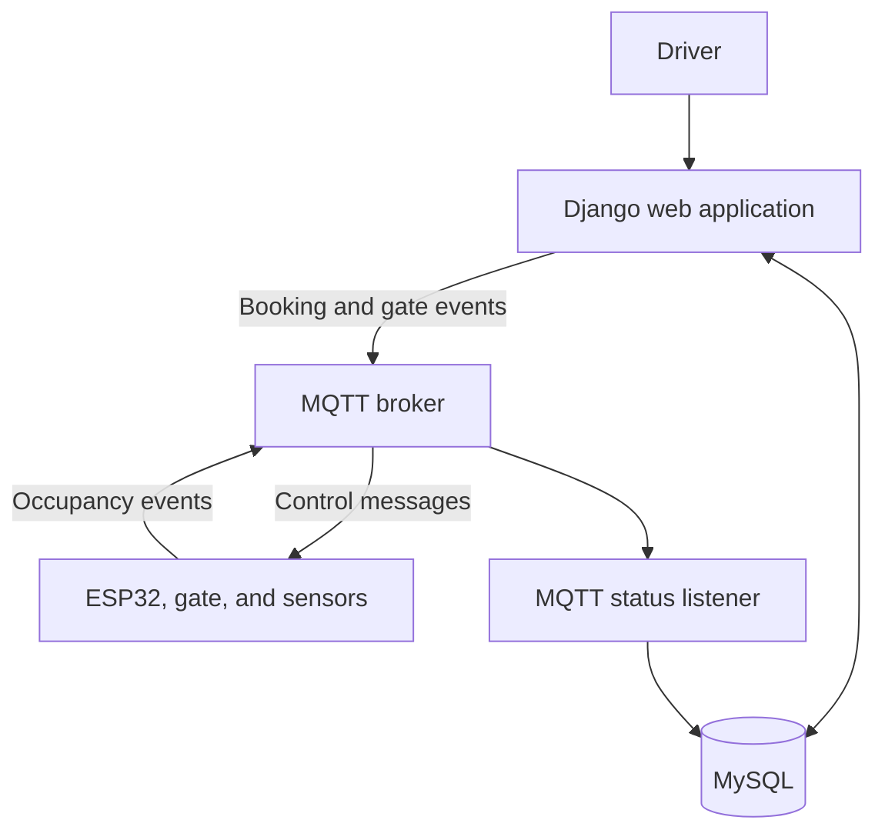

<p align="center">
  
</p>

<div align="center">

<h3>Online parking reservations. Token-based gate access.</h3>

<p>A Django application that brings parking discovery, slot booking,<br>reservation management, and ESP32 gate communication into one workflow.</p>

<p>
  
  
  
  
</p>

<p>
  <a href="#product-preview">Preview</a> &nbsp;·&nbsp;
  <a href="#capabilities">Features</a> &nbsp;·&nbsp;
  <a href="#architecture">Architecture</a> &nbsp;·&nbsp;
  <a href="#getting-started">Get started</a> &nbsp;·&nbsp;
  <a href="https://github.com/ZaidShaikh-2005/parking-management-system/issues">Report an issue</a>
</p>

</div>

---

## Product preview

<p align="center">
  
</p>

<p align="center"><sub>Animated walkthrough assembled from the application's screenshots.</sub></p>

## Overview

ParkWise connects the online reservation process with parking access management. Drivers can browse parking areas, view slot availability, make a reservation, and use a generated booking token at the gate. Administrators manage parking inventory, users, and reservations through Django's administration interface.

The web application stores parking and booking records in MySQL. MQTT modules publish booking and gate events and provide a listener for occupancy updates from the hardware integration.

## Capabilities

| Area | Functionality |
| :--- | :--- |
| **Accounts** | Registration, login, password reset, and customer profile management. |
| **Parking discovery** | Parking area listings with images, pricing, and slot availability. |
| **Reservations** | Slot selection, booking confirmation, and reservation history. |
| **Booking tokens** | Unique reservation tokens for the gate verification workflow. |
| **Gate access** | Token verification and MQTT events for the ESP32 gate integration. |
| **Occupancy management** | Available and occupied slot views, with an MQTT listener for hardware status updates. |
| **Sharing and email** | WhatsApp sharing during checkout and SMTP configuration for account email flows. |
| **Administration** | Management of users, customers, parking lots, slots, bookings, and tokens. |

## Architecture



Hardware operation requires a running MQTT broker, compatible ESP32 firmware, and the connected gate and sensors.

## Technology

| Layer | Technologies |
| :--- | :--- |
| Backend | Python, Django |
| Database | MySQL, Django ORM |
| Interface | HTML, CSS, JavaScript, Bootstrap |
| Device communication | MQTT, Paho MQTT client |
| Associated hardware | ESP32, parking gate, ultrasonic sensors |
| Access management | Django authentication and booking token validation |

## Getting started

### Prerequisites

- Python 3.11 or later and a running MySQL server.
- A MySQL database named `SmartParkingZaid`, matching the current project configuration.
- A valid machine-specific archive at `license/license.zip`. Startup validates this license before running Django management commands.
- An MQTT broker and compatible hardware for the gate and occupancy integration.

### 1. Clone and install

Run these commands in a Windows terminal:

```powershell
git clone https://github.com/ZaidShaikh-2005/parking-management-system.git
cd parking-management-system

python -m venv .venv
.\.venv\Scripts\python.exe -m pip install --upgrade pip
.\.venv\Scripts\python.exe -m pip install -r requirements.txt "Django==5.2.12" "mysqlclient==2.2.8" "paho-mqtt==2.1.0"
```

These versions match the dependency metadata in the repository's included environment. The command also installs the MySQL and MQTT clients, which are imported by the project but are absent from `requirements.txt`.

<details>
<summary>macOS and Linux commands</summary>

```bash
git clone https://github.com/ZaidShaikh-2005/parking-management-system.git
cd parking-management-system

python3 -m venv .venv
.venv/bin/python -m pip install --upgrade pip
.venv/bin/python -m pip install -r requirements.txt "Django==5.2.12" "mysqlclient==2.2.8" "paho-mqtt==2.1.0"
```

Install the MySQL client development libraries required by `mysqlclient` for your operating system.

</details>

### 2. Configure the database

Create the database through your MySQL client:

```sql
CREATE DATABASE SmartParkingZaid CHARACTER SET utf8mb4;
```

Update `DATABASES` in `soloRising/settings.py` with your MySQL username, password, host, and port. The current configuration uses Django's MySQL backend.

### 3. Initialize and run

Once the database connection and machine license are configured:

```powershell
.\.venv\Scripts\python.exe manage.py migrate
.\.venv\Scripts\python.exe manage.py createsuperuser
.\.venv\Scripts\python.exe manage.py runserver
```

Open [the application](http://127.0.0.1:8000/) or [Django administration](http://127.0.0.1:8000/admin/). Use the administrator account to create parking lots and slots before making reservations.

On macOS or Linux, use `.venv/bin/python` in place of `.\.venv\Scripts\python.exe`.

### 4. Configure integrations

| Integration | Configuration |
| :--- | :--- |
| **MQTT publisher** | Set the broker address and port in `app/mqtt_client.py`. Booking and gate events are published to `parking/control`. |
| **MQTT listener** | Set the broker connection in `app/mqtt_listener.py`. It subscribes to `parking/booking`; the firmware must publish compatible status messages. |
| **Email** | Configure your SMTP connection through the `EMAIL_*` settings in `soloRising/settings.py`. |
| **WhatsApp sharing** | Review the checkout share-link configuration in `app/templates/app/checkout.html` for your installation. |

Run the MQTT listener in a separate terminal when using the hardware integration:

```powershell
.\.venv\Scripts\python.exe app/mqtt_listener.py
```

## Interface gallery

<details>
<summary>View all application screenshots</summary>

| Parking areas | Sign in |
| :---: | :---: |
|  |  |

| Slot availability | Reservation confirmed |
| :---: | :---: |
|  |  |

| Gate verification | Administration |
| :---: | :---: |
|  |  |

</details>

## Repository guide

| Path | Purpose |
| :--- | :--- |
| `app/` | Models, views, forms, templates, static assets, and MQTT modules. |
| `soloRising/` | Django project settings and URL configuration. |
| `license/` | Machine license validation utilities and archive. |
| `media/` | Uploaded application media. |
| `screenshots/` | Application screenshots used in this README. |
| `docs/media/` | ParkWise banner and animated preview. |
| `manage.py` | Django management entry point. |
| `requirements.txt` | Project dependency list. |

## Planned improvements

- Integrated payment processing with transaction verification.
- QR-based gate entry alongside booking tokens.
- Administrative reporting and parking usage analytics.
- Mobile-friendly reservation and management experiences.

## Feedback

Report bugs and suggest improvements through [GitHub Issues](https://github.com/ZaidShaikh-2005/parking-management-system/issues). Include the page or workflow involved, the steps to reproduce the issue, and any relevant error message.

---

<p align="center">
  <strong>ParkWise</strong><br>
  Developed by <a href="https://github.com/ZaidShaikh-2005">Zaid Shaikh</a>
</p>
